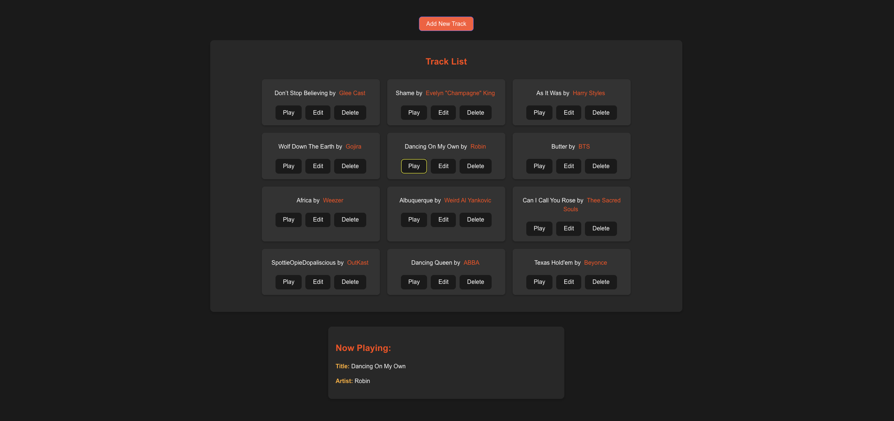

# 

Welcome to Reactville, a constantly evolving virtual metropolis. Let's build this digital town together, one component at a time.

## About

The community center of Reactville is launching an exciting project—a public jukebox! Your task is to help them build an interactive user interface where everyone can collaborate to manage the track library. Users will be able to add, update, and remove tracks, creating a dynamic playlist that all residents can enjoy at town events!

By the end of this lab, students will have developed a frontend that interacts with a RESTful API, enabling users to perform create, read, update, and delete (CRUD) operations on "track" data. This lab provides a practical application for consuming an API with React.

> This module requires an existing API to perform CRUD operations on a `track` resource.

## Prerequisites

- Controlled Forms in React
- Lifting State in React
- Fetching Data in React
- Express API - Jukebox Back-End Lab

## Time to complete

Estimated time to complete core lab exercise: **8 hours**

## Content

- [Setup](./setup/README.md)
- [Exercise](./exercise/README.md)

## Level Up

🚀 [Level Up](./level-up/README.md)

## Solution code

🏁 [Solution code](https://git.generalassemb.ly/modular-curriculum-all-courses/react-jukebox-front-end-lab-solution)

## Internal resources

✏️ [Instructor Guide](./internal-resources/instructor-guide.md)

🏗️ [Release Notes](./internal-resources/release-notes.md)

---

**Find a 👾 bug 👾 or have suggestions? [Let us know](https://git.generalassemb.ly/modular-curriculum-all-courses/universal-resources-internal/blob/main/module-feedback.md)!**
